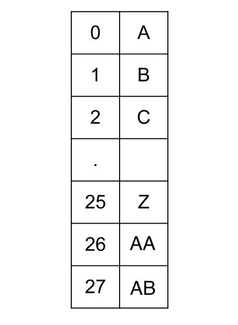

# [Excel Sheet Column Title](https://leetcode.com/problems/excel-sheet-column-title/)

## Approach:


At first glance, it might be tempting to say that these numbers are just base 26, but the catch is that in a base 26 system, the numbers would start from 0.

However, in the problem, we have the number starting from 1, not 0. But we can change them to process them like base 26 numbers. The important point to observe here is that every column title has the corresponding column number as a number in **base 26 plus one**.

Therefore, we need to subtract 1 from the number before taking the modulo.

- **Time Complexity:** $O(Log_{26}n)$
- **Space Complexity:** $O(1)$
  

```cpp
class Solution {
public:
    string convertToTitle(int cn) {
        string ans = "";

        while(cn > 0){
            cn--;
            ans += ((char)(cn%26 + 'A'));
            cn /= 26;
        }

        reverse(ans.begin(), ans.end());
        return ans;
    }
};
```